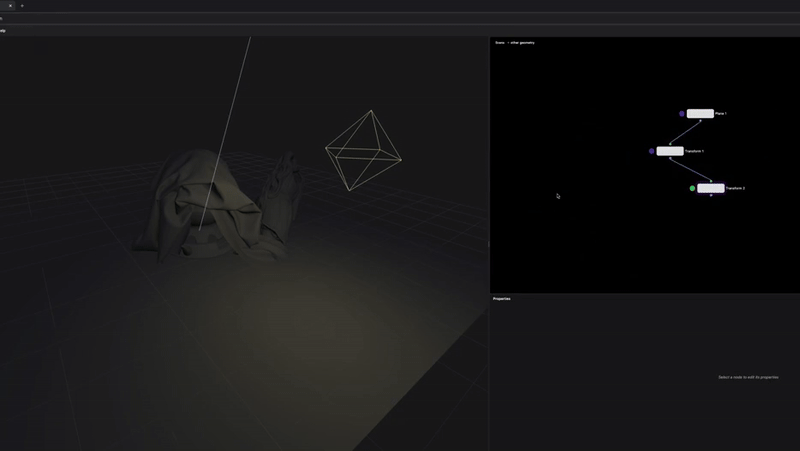
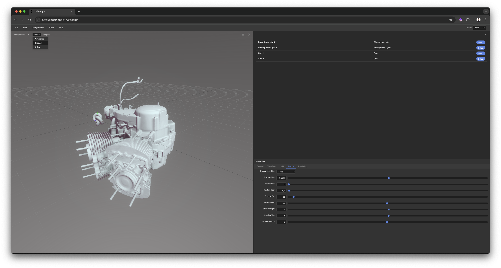

# Minimystx

A browser-based parametric design studio built with React, TypeScript, and WebAssembly for instant, high-performance 3D modeling and lighting design.

| [](https://youtu.be/bxHWWFmj-JE) | [](https://youtu.be/c9Ud1GaUZ9Y) |
|:---:|:---:|
| **Minimystx PoC Overview** | **Minimystx Early PoC Build** |

## Overview

Minimystx is a sophisticated browser-only parametric design studio that combines React and TypeScript with WebAssembly for high-performance 3D operations. It features a professional node-based editing system similar to Houdini/Grasshopper with a split interface showing both the node editor and real-time 3D viewport simultaneously. The application includes advanced features like hierarchical subflow systems, comprehensive lighting tools, scene serialization, and performance-optimized computation with intelligent caching.

|  |  |
|:---:|:---:|

## Features

### User Experience

- Instant entry with minimal landing page and client-side navigation
- Split workspace with Three.js 3D viewport and React Flow node editor
- Node-based parametric design with real-time 3D feedback
- Hierarchical subflow system for complex project organization
- Comprehensive lighting design with 6 light types
- Professional keyboard navigation and shortcuts
- Persistent UI state and viewport management

### Technical Implementation

- React 19.1.0 + TypeScript 5.2.2 frontend with Vite
- WebAssembly backend for performance-critical operations
- Three.js 0.178.0 with @react-three/fiber and @react-three/drei for hardware-accelerated 3D graphics
- @xyflow/react for interactive node-based workflows
- Zustand with Immer for reactive state management
- Cook-on-Demand computation system with intelligent caching
- Render Cone Scheduler for optimized selective updates

### Design System

- Color-coded port types with context-aware node organization
- Streamlined node workflow with hover enlargement and inline controls
- Advanced node palette with fuzzy search and keyboard navigation
- Professional interaction patterns (space+drag, multi-view camera system)
- Responsive visual feedback with magnetized connections and hover highlights

### File Format Support

- **Export**: MXSCENE format (custom ZIP-based project files with asset embedding)
- **Import**: OBJ and glTF/GLB geometry files
- **Asset Management**: OPFS-based caching with SHA256 integrity verification

### Node System

#### Root Nodes

- **GeoNode** - Hierarchical container for subflow organization and geometry output

#### 3D Primitives

- **Box** - Parametric box/cube geometry with width, height, depth controls
- **Sphere** - Parametric sphere geometry with radius and segment controls
- **Cylinder** - Parametric cylinder geometry with radius, height, and segment controls
- **Cone** - Parametric cone geometry with radius, height, and segment controls
- **Plane** - Parametric plane geometry with width, height, and subdivision controls
- **Torus** - Parametric torus (donut) geometry with major/minor radius controls
- **TorusKnot** - Parametric torus knot geometry with advanced mathematical parameters

#### Lighting System

- **Point Light** - Omnidirectional point light source with color and intensity
- **Ambient Light** - Global ambient lighting for scene illumination
- **Directional Light** - Directional lighting (sun-like) with shadow support
- **Spot Light** - Focused spot lighting with cone angle and penumbra controls
- **Hemisphere Light** - Ambient hemisphere lighting with sky/ground colors
- **Rect Area Light** - Rectangular area light source for architectural lighting

#### Import & I/O

- **Import OBJ** - Import OBJ file format geometry with material support
- **Import glTF** - Import glTF/GLB files with full scene, animation, and material support

#### Modifiers

- **Transform** - Apply translation, rotation, and scale transformations to geometry

#### Utility

- **Note** - Add text annotations and documentation to node graphs

### Keyboard Shortcuts

#### Flow Canvas Navigation

- `G` - Toggle grid visibility
- `M` - Toggle minimap visibility
- `C` - Toggle flow controls visibility
- `S` - Cycle through connection line styles (bezier, straight, step, simpleBezier)
- `F` - Fit nodes to view
- `Shift+F` - Fit nodes (alternative)
- `L` - Auto-layout cycle
- `Shift+L` - Auto-layout (force all nodes)
- `Delete/Backspace` - Delete selected edges

#### 3D Viewport Navigation

- `G` - Toggle grid visibility
- `W` - Toggle wireframe mode
- `X` - Toggle x-ray mode
- `F` - Set front orthographic view
- `T` - Set top orthographic view
- `L` - Set left orthographic view
- `R` - Set right orthographic view
- `B` - Set bottom orthographic view
- `Shift+F` - Fit view to geometry
- `P` - Switch to perspective camera
- `O` - Switch to orthographic camera
- `A` - Toggle axis gizmo visibility

#### Global Navigation

- Space+drag - Pan the canvas
- Mouse wheel - Zoom in/out

## Getting Started

### Prerequisites

- Node.js (version 18 or higher recommended)
- Rust and Cargo (for WebAssembly compilation)
- wasm-pack (for building WebAssembly modules)
- Modern browser with WebGL support

### Installation

1. Clone the repository:

   ```bash
   git clone https://github.com/marko-koljancic/minimystx.git
   cd minimystx
   ```

2. Install dependencies:

   ```bash
   npm install
   ```

3. Build the WebAssembly core:

   ```bash
   npm run build-core
   ```

4. Start the development server:

   ```bash
   npm run dev
   ```

## Build

To build the complete project for production:

```bash
npm run build-all
```

This will:

1. Build the WebAssembly components with `build-core`
2. Compile TypeScript files and bundle the application with Vite using `build`

You can also run these steps separately:

```bash
npm run build-core  # Build WebAssembly components only
npm run build       # Build TypeScript and bundle with Vite only
```

## Architecture Overview

### Core System Design

Minimystx implements a reactive computation graph architecture with advanced performance optimizations:

- **Cook-on-Demand System** - Intelligent computation scheduling that only processes changed nodes
- **Content Cache** - LRU caching system with dependency tracking and validity hashing
- **Render Cone Scheduler** - Optimized rendering pipeline that selectively updates only visible geometry
- **Subflow Manager** - Hierarchical node graph system enabling complex project organization

### Data Flow Architecture

1. **Node Registry** - Central registry managing all node types with compute functions and metadata
2. **Graph Store** - Zustand-based reactive state management with Immer for immutable updates
3. **Computation Engine** - Topological sorting with cycle detection for efficient graph evaluation
4. **Scene Serialization** - Complete project state persistence with the custom MXSCENE format

### Performance Optimizations

- **Intelligent Caching** - Content-aware caching with automatic invalidation on parameter changes
- **Selective Rendering** - Render cone optimization processes only nodes affecting final output
- **Asset Management** - OPFS-based browser storage with SHA256 integrity verification
- **Memory Management** - LRU eviction and dependency-aware cache pruning

## Project Structure

```plaintext
minimystx/
├── src/
│   ├── App.tsx         # Main application component
│   ├── main.tsx        # Application entry point
│   ├── assets/         # Asset files (models, IFC samples)
│   ├── common/         # Shared UI components and design system
│   ├── components/     # Reusable React components
│   ├── engine/         # Core computation and graph engine
│   │   ├── cache/      # Content caching system
│   │   ├── compute/    # Cook-on-demand computation
│   │   ├── containers/ # Data container abstractions
│   │   ├── graph/      # Graph processing and adapters
│   │   ├── nodes/      # Node builder and management
│   │   ├── scheduler/  # Render cone scheduler
│   │   ├── subflow/    # Hierarchical subflow system
│   │   ├── types/      # Core type definitions
│   │   ├── computeEngine.ts     # Main computation orchestration
│   │   ├── graphStore.ts        # Reactive graph state management
│   │   ├── nodeRegistry.ts      # Node type registry and search
│   │   └── parameterUtils.ts    # Parameter validation utilities
│   ├── flow/           # Node-based visual editor
│   │   ├── edges/      # Connection components
│   │   └── nodes/      # Node UI and computation definitions
│   ├── hooks/          # Custom React hooks
│   ├── io/             # File I/O and scene management
│   │   └── mxscene/    # MXSCENE format implementation
│   ├── pages/          # Page components and routing
│   ├── panels/         # UI panels and interface components
│   ├── rendering/      # 3D rendering and Three.js integration
│   ├── store/          # UI state management
│   ├── styles/         # CSS and design system
│   ├── utils/          # Utility functions
│   └── wasm/           # WebAssembly integration
│       ├── src/        # Rust source code
│       └── pkg/        # Compiled WebAssembly modules
├── public/             # Static assets
└── docs/               # Architecture and API documentation
```

## Development

- `npm run dev` - Start development server
- `npm run build` - Build TypeScript and bundle with Vite
- `npm run build-core` - Build WebAssembly components
- `npm run build-all` - Build both WebAssembly components and TypeScript bundle
- `npm run lint` - Run ESLint
- `npm run preview` - Preview production build

## License

[MIT License](LICENSE)

## Contributing

1. Fork the repository
2. Create your feature branch: `git checkout -b feature/amazing-feature`
3. Commit your changes: `git commit -m 'Add some amazing feature'`
4. Push to the branch: `git push origin feature/amazing-feature`
5. Open a Pull Request

## Contact

[Marko Koljancic](https://koljam.com/)
